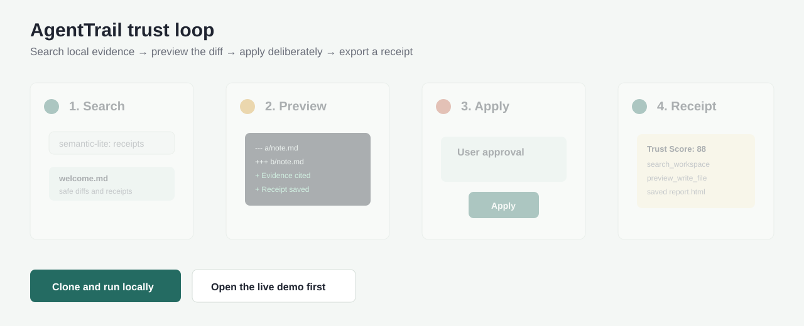
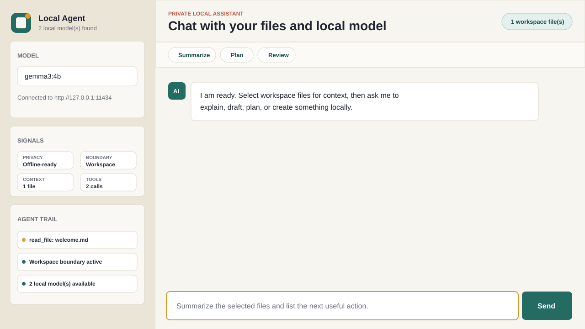
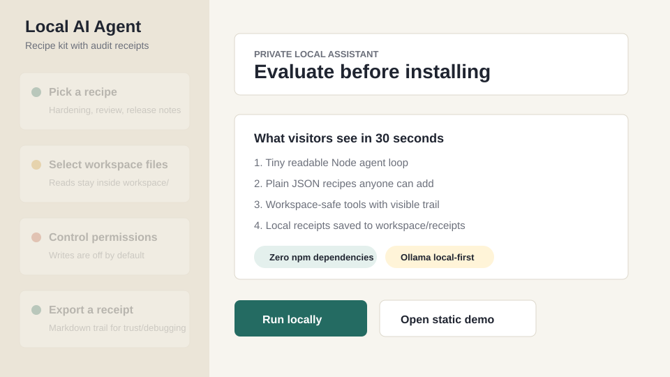

# AgentTrail Local AI Agent

[](https://github.com/Mughal-Baig/local-ai-agent/actions/workflows/ci.yml)


AgentTrail is a tiny, auditable local AI agent kit for people who want a Claude/ChatGPT/Gemini-style workspace assistant without sending files to a cloud service.


The demo loop: semantic local search -> diff preview -> explicit Apply -> receipt/report/replay.







**Live demo:** [mughal-baig.github.io/local-ai-agent/demo.html](https://mughal-baig.github.io/local-ai-agent/demo.html)

**Core promise:** a local agent should show what it searched, what it read, what it planned to write, and why you can trust it.

## Why Star This

- **Transparent by default**: every tool call is shown as an Agent Trail receipt.
- **Search before answer**: keyword search plus real local vector search with Ollama embeddings when available.
- **Diff-safe writes**: preview mode shows a unified diff in chat and lets the user apply it deliberately.
- **Trust Score dashboard**: each run shows evidence, preview, receipt, memory, hardening, and eval signals.
- **Receipt timeline, replay, and reports**: reopen a saved run, restore prompt/files/model/diffs, and export Markdown/HTML reports.
- **Recipe-driven**: reusable local workflows live in plain JSON files anyone can add.
- **Demo-first**: the GIF and static demo let visitors understand the project before installing Ollama.
- **Permission-aware**: file reads are explicit and file writes are off by default.
- **Private by design**: the server only talks to Ollama and the local browser UI.
- **Safe workspace boundary**: file reads and writes are blocked outside `workspace/`.
- **Zero npm dependencies**: clone, run `node server.js`, and start building.
- **Serious foundation**: schemas, migrations, permission engine, background jobs, backups, plugins, checksums, and tests keep it from feeling like a toy.
- **Product proof loop**: chunk citations, replay guidance, model comparison, plugin gallery, onboarding, and trust badges make the value obvious fast.

## What Makes It Different

Popular local AI tools are often full platforms. This project is intentionally smaller: it is a starter agent you can read, modify, and trust in an afternoon.

| Area | AgentTrail |
| --- | --- |
| Setup | One Node command, `npx`-ready package metadata, Docker Compose, Homebrew formula draft, desktop launchers |
| Model backend | Ollama |
| File access | Sandboxed workspace tools plus keyword search, local vector index, and Ollama embedding index |
| Trust UX | Trust Score, local signals, security scan, reviewable diff previews, explicit apply buttons, exportable reports, replay sessions, receipts, and tool history |
| Workflow system | Plain JSON recipes, role-based recipe packs, import/export UI, and marketplace manifest |
| Foundation | Stable schemas, migrations, append-only store, permission engine, plugin manifests, backups, jobs, checksums |
| Best use | Personal workspace agent starter kit and auditable local workflow lab |

## 60-second Quick Start

```bash
git clone https://github.com/Mughal-Baig/local-ai-agent.git
cd local-ai-agent
ollama pull llama3.2
npx github:Mughal-Baig/local-ai-agent
```

Or clone and run:

```bash
git clone https://github.com/Mughal-Baig/local-ai-agent.git
cd local-ai-agent
node server.js
```

Open `http://127.0.0.1:4173`, build the semantic index, ask for a change, review the diff, click **Apply**, then export the receipt/report/replay session.

## Features

- Chat UI with model picker and streaming-style responses
- Starter prompts for summarize, plan, review, and save-note workflows
- Local recipe picker backed by plain JSON workflow files
- Keyword search and semantic local search across workspace files, sessions, and saved receipts
- Ollama embedding index using `OLLAMA_EMBED_MODEL=nomic-embed-text`, with local-vector fallback
- First-run setup checklist for Ollama, models, workspace files, recipes, and receipts
- Attachment picker that copies local files into `workspace/attachments/` and selects them for agent context
- Permission toggles for file reads, file writes, write preview mode, and security hardening mode
- Ollama integration for local models
- Model capability scoring for coding, tool use, planning, and long context
- Workspace-aware tools: list files, search files, read files, preview writes, and write files
- In-chat diff cards with explicit **Apply** buttons for proposed file changes
- Diff Review center with pending-change apply/reject controls
- Agent Trail receipts for tool calls, selected context, model status, and errors
- Receipt timeline, replayable saved sessions, and exportable Markdown/HTML reports
- Project memory stored locally with visible citations, revision history, and prompt context
- Recipe packs for coder, founder, and security workflows, plus marketplace manifest and import/export route
- Real MCP stdio server with explicit per-tool approvals and receipts
- Workspace profile templates with profile switching API/UI
- Local evaluation harness plus saved pass/fail history and model benchmark surface
- Dockerfile, Docker Compose, `agenttrail` bin entry, install script, Homebrew formula draft, desktop launchers, and a macOS `.app` bundle generator
- Stable schemas exposed at `/api/schemas`
- Route catalog exposed at `/api/routes`
- Config validation exposed at `/api/config`
- Structured logs exposed at `/api/logs`
- SQLite store exposed at `/api/sqlite/status`
- File watcher controls exposed at `/api/watch/status`, `/api/watch/start`, and `/api/watch/stop`
- Append-only local event store exposed at `/api/store/stats`
- Migration system exposed at `/api/migrations`
- Background jobs exposed at `/api/jobs`
- Plugin manifests exposed at `/api/plugins`
- Plugin sandbox execution exposed at `/api/plugins/run`
- Backup export exposed at `/api/backup/export`
- Backup import exposed at `/api/backup/import`
- Release checksums exposed at `/api/releases/checksums`
- Release signing plan exposed at `/api/releases/signing-plan`
- Separate frontend foundation and product modules in `public/modules/`
- Saved receipt history in `workspace/receipts/`
- Safe path handling so the agent stays inside `workspace/`
- Smoke test and GitHub Actions CI included

## Comparison

| Tool | Main strength | AgentTrail difference |
| --- | --- | --- |
| Open WebUI | Broad self-hosted chat platform | Smaller, auditable agent kit with receipts and diff apply flow |
| AnythingLLM | Document chat and workspaces | Lighter starter kit focused on transparent local tool use |
| Jan | Polished offline chat app | Adds workspace tools, recipes, Trust Score, and receipts |
| Aider | Terminal coding agent | Browser UI with explicit diff approval and reports |
| OpenHands | Full coding-agent platform | Tiny local-first lab you can read and fork quickly |

## Quick Start

1. Install [Ollama](https://ollama.com/download).
2. Pull a model:

   ```bash
   ollama pull llama3.2
   ```

3. Start this app:

   ```bash
   node server.js
   ```

   macOS and Linux users can also run:

   ```bash
   ./start.sh
   ```

4. Open:

   ```text
   http://127.0.0.1:4173
   ```

You can also use:

```bash
npm start
```

Other install paths:

```bash
npm link
agenttrail
docker build -t agenttrail .
docker run --rm -p 4173:4173 -v "$PWD/workspace:/app/workspace" agenttrail
docker compose up --build
./install.sh
npm run package:mac-app
```

## Try It

1. Open the app.
2. Select `welcome.md` in the workspace.
3. Click **Summarize** or ask:

   ```text
   Summarize the selected file and create a checklist for improving the project.
   ```

4. Watch the Agent Trail for local model, context, and tool receipts.

## Recipes

Recipes are reusable local workflows stored as JSON files in [recipes](recipes).

Each recipe has:

- `title`
- `description`
- `tags`
- `prompt`

Good recipe ideas are easy to review and useful without any cloud service: code review, launch notes, security hardening, receipt summaries, research briefs, and workspace planning.

Recipe shape is documented in [recipes/schema.json](recipes/schema.json).

## How It Works

The browser sends messages to the local Node server. The server sends a prompt to Ollama with a small tool protocol. When the model requests a tool, the server runs it against the workspace and sends the result into the next model step.

Available tools:

- `list_files`: shows files in the workspace
- `search_workspace`: searches local files, sessions, receipts, and memory for relevant context
- `read_file`: reads a workspace file
- `preview_write_file`: returns a diff preview without writing
- `write_file`: creates or updates a workspace file

When write preview mode is enabled, `write_file` returns a diff preview instead of changing the file. The browser shows that diff with an explicit **Apply** button, keeping the default experience reviewable even when an LLM tries to write.

## Top 1% Surfaces

- Visual demo proof: [docs/agenttrail-demo.gif](docs/agenttrail-demo.gif), [docs/top1-demo.svg](docs/top1-demo.svg)
- True semantic search: `/api/search-index`, `/api/search?mode=semantic`, Ollama embeddings with local-vector fallback
- Receipt timeline and replay: saved Markdown receipts in `workspace/receipts/`, JSON sessions in `workspace/sessions/`
- Diff Review center: pending preview apply/reject UI
- Local attachments: `/api/attachments` plus browser file picker that saves files into the workspace
- MCP bridge: [mcp/server.js](mcp/server.js) and [mcp/agenttrail.mcp.json](mcp/agenttrail.mcp.json)
- Recipe marketplace: [marketplace/recipes.json](marketplace/recipes.json), [recipe-packs](recipe-packs), `/api/packs/import`
- One-command install surfaces: `bin/agenttrail.js`, [Dockerfile](Dockerfile), [docker-compose.yml](docker-compose.yml), [install.sh](install.sh), [Formula/agenttrail.rb](Formula/agenttrail.rb), [desktop](desktop)
- Physical Mac app: `npm run package:mac-app` builds `dist/mac/AgentTrail.app`
- Model scoring and benchmarking: `/api/status`, `/api/benchmarks`
- Agent eval harness and history: `npm run eval`, `/api/evals`, `/api/evals/history`
- Project memory: `workspace/memory/project-memory.md`, citations, and revision history
- Workspace profiles: [profiles](profiles), `/api/profiles/apply`
- Trust Score dashboard: browser UI
- README star engine: demo, comparison, 60-second quick start, roadmap
- Security hardening engine: prompt flags, path escape checks, exfiltration patterns, `/api/security/scan`
- Shareable reports: polished Markdown/HTML exports in `workspace/reports/`
- Community growth loop: issue templates, launch posts, marketplace submissions, and good-first contribution docs
- Guided replay: `/api/replay/plan`
- Chunk citations: `/api/search/chunks`
- Trust badge: `/api/trust/badge`
- Model comparison: `/api/models/compare`
- Real benchmark run endpoint: `/api/benchmarks/run`
- Pack import from GitHub URL: `/api/marketplace/import-url`
- Public demo data: `/api/demo/public` and [docs/public-demo.html](docs/public-demo.html)
- MCP client setup examples: [docs/mcp/CLIENT_SETUP.md](docs/mcp/CLIENT_SETUP.md)

## Foundation Surfaces

- Server modules: [src](src)
- Stable schemas: [docs/SCHEMAS.md](docs/SCHEMAS.md)
- Permission engine: [src/permissions.js](src/permissions.js)
- Model adapters: [src/model-adapters.js](src/model-adapters.js)
- Migration system: [src/migrations.js](src/migrations.js)
- Append-only store: [src/json-store.js](src/json-store.js)
- Background jobs: [src/jobs.js](src/jobs.js)
- Plugin architecture: [plugins](plugins)
- Release checksums: [docs/RELEASE_SIGNING.md](docs/RELEASE_SIGNING.md)
- Backup export: `workspace/backups/`
- SQLite store: `workspace/.agenttrail/agenttrail.db`
- Structured logs: `workspace/.agenttrail/logs.jsonl`
- Versioned migration files: [migrations](migrations)

## Workspace

Put project notes, drafts, and files you want the agent to work with inside:

```text
workspace/
```

The app intentionally blocks paths outside that folder.

## Configuration

Create `.env` from `.env.example` or set environment variables directly:

```bash
PORT=4173 OLLAMA_MODEL=llama3.2 node server.js
```

Supported variables:

- `PORT`: local web server port
- `HOST`: bind address, default `127.0.0.1`; Docker uses `0.0.0.0`
- `OLLAMA_HOST`: Ollama API host
- `OLLAMA_MODEL`: default model name
- `OLLAMA_EMBED_MODEL`: local embedding model for semantic index, default `nomic-embed-text`
- `WORKSPACE_ROOT`: folder the agent can access
- `MAX_TOOL_ITERATIONS`: maximum tool loop steps per message

## Troubleshooting And Models

- [Troubleshooting](docs/TROUBLESHOOTING.md)
- [Model guide](docs/MODELS.md)
- [Security checklist](docs/SECURITY_CHECKLIST.md)

## Test

```bash
node scripts/smoke-test.js
npm run test:unit
npm run test:integration
npm run test:ui
npm run eval
npm run release:checksums
npm run package:desktop
npm run package:mac-app
```

The smoke test starts the server on a temporary port, checks the UI and API, writes a test file in a temporary workspace, reads it back, and shuts the server down.

## Roadmap

See [docs/ROADMAP.md](docs/ROADMAP.md).

## Growth Research

See [docs/GROWTH_RESEARCH.md](docs/GROWTH_RESEARCH.md) for research-backed positioning, [docs/LAUNCH_PLAN.md](docs/LAUNCH_PLAN.md) for the public launch checklist, and [docs/TOP_1_PERCENT_PLAYBOOK.md](docs/TOP_1_PERCENT_PLAYBOOK.md) for the focused growth path.

The v0.7 implementation map is in [docs/TOP_1_PERCENT_IMPLEMENTATION.md](docs/TOP_1_PERCENT_IMPLEMENTATION.md).

## Contributing

Small, focused contributions are welcome. See [CONTRIBUTING.md](CONTRIBUTING.md).

## Upload To GitHub

If GitHub CLI is installed and authenticated:

```bash
git add .
git commit -m "Create local AI agent"
gh repo create local-ai-agent --private --source=. --remote=origin --push
```

Use `--public` instead of `--private` if you want the repository to be visible to everyone.

If you already created a GitHub repo:

```bash
git remote add origin https://github.com/YOUR_USERNAME/local-ai-agent.git
git branch -M main
git push -u origin main
```

## Notes

This is not a clone of Claude, ChatGPT, or Gemini. It is a local AI assistant with a similar chat-and-workspace workflow that you control on your own machine.
