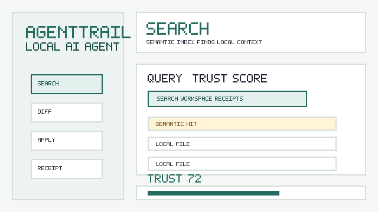
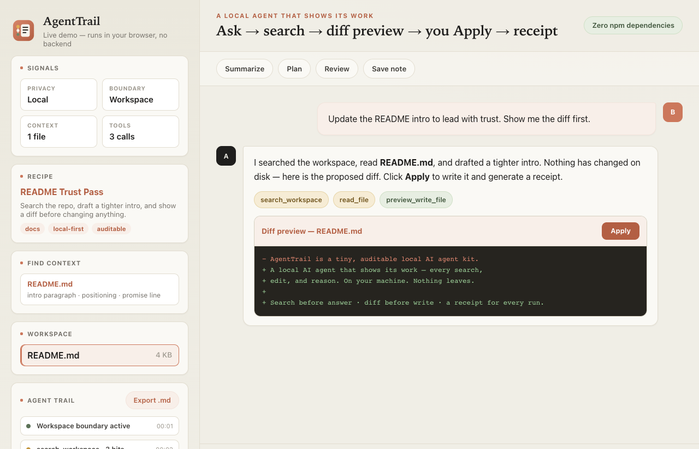
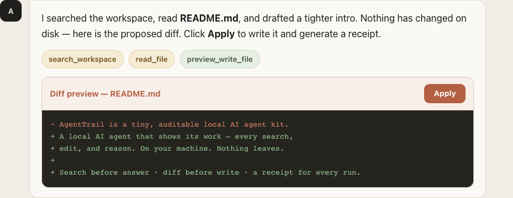

# AgentTrail Local AI Agent

[](https://github.com/Mughal-Baig/local-ai-agent/actions/workflows/ci.yml)


> ### A local AI agent that shows its work.
> Every search, every edit, every reason — on your machine. Nothing leaves.



*The loop: **ask → search before answer → diff preview → you click Apply → replayable receipt.** Every step is shown. Writes are off by default.*

**Live demo, zero install:** [mughal-baig.github.io/local-ai-agent/demo.html](https://mughal-baig.github.io/local-ai-agent/demo.html) or the richer [public recipe/safety/receipt demo](https://mughal-baig.github.io/local-ai-agent/public-demo.html)

ChatGPT and Claude are great — until you need them to touch private files. AgentTrail gives you that same chat-and-workspace workflow, but it runs entirely on your machine with Ollama, and it turns every action into an auditable, replayable receipt. It is the only local agent built so you can verify exactly what it did and why.

## A Look Inside



A calm, grouped workspace: model and files up top, every tool call logged in the Agent Trail, and a live Trust Score — collapsible sections keep the power tools one click away instead of in your face.



Writes are off by default. The agent proposes a unified diff; you click **Apply**; the run becomes a receipt you can reopen, export, and replay.

## GitHub Visual Assets

- Hero GIF: [`docs/agenttrail-demo.gif`](docs/agenttrail-demo.gif)
- UI preview: [`docs/preview-app.png`](docs/preview-app.png)
- Diff preview: [`docs/preview-diff.png`](docs/preview-diff.png)
- Social preview upload asset: [`docs/social-preview.png`](docs/social-preview.png)

## Why Star This

- **Transparent by default**: every tool call is shown as an Agent Trail receipt.
- **Search before answer**: keyword search plus versioned local vector search with Ollama embeddings when available.
- **Diff-safe writes**: preview mode shows a unified diff in chat and lets the user apply it deliberately.
- **Trust Score dashboard**: each run shows evidence, preview, receipt, memory, hardening, and eval signals.
- **Local observability**: Prometheus-style metrics, run traces, token/time accounting, and aggregate analytics stay on the machine.
- **Local team mode**: read-only shared receipts, local users, RBAC caps, sync exports, audit exports, and an SSO identity hook.
- **Budgeted project memory**: structured memory is ranked by the current prompt/files/tools before it enters the model context.
- **Receipt timeline, replay, and reports**: reopen a saved run, restore prompt/files/model/diffs, and export Markdown/HTML reports.
- **Recipe-driven**: reusable local workflows live in plain JSON files anyone can add.
- **Demo-first**: the GIF and static demo let visitors understand the project before installing Ollama.
- **Permission-aware**: file reads are explicit and file writes are off by default.
- **Private by design**: the server only talks to Ollama and the local browser UI.
- **Safe workspace boundary**: file reads and writes are blocked outside `workspace/`.
- **Zero npm dependencies**: clone, run `node server.js`, and start building.
- **Serious foundation**: schemas, migrations, permission engine, background jobs, backups, plugins, SBOM, signed-checksum path, reproducible package checks, and tests keep it from feeling like a toy.
- **Product proof loop**: exact line/character citations, replay guidance, model comparison, plugin gallery, onboarding, and trust badges make the value obvious fast.

## What Makes It Different

Popular local AI tools are often full platforms. This project is intentionally smaller: it is a starter agent you can read, modify, and trust in an afternoon.

| Area | AgentTrail |
| --- | --- |
| Setup | One Node command, `npx`-ready package metadata, multi-arch Docker workflow, publishable Homebrew formula, desktop launchers |
| Model backend | Ollama, or any OpenAI-compatible local server (LM Studio, llama.cpp, vLLM, Jan) — see [Model Backends](docs/MODEL_BACKENDS.md) |
| File access | Sandboxed workspace tools plus keyword search, versioned local vector store, and Ollama embedding index |
| Trust UX | Trust Score, local signals, security scan, reviewable diff previews, explicit apply buttons, exportable reports, replay sessions, receipts, and tool history |
| Observability | Structured logs, `/api/metrics`, per-run traces, token/time accounting, error taxonomy, and privacy-preserving local analytics |
| Team/audit | Read-only shared receipts, local multi-user profiles, RBAC tool caps, audit export, opt-in local sync packs, and SSO header/domain hook |
| Workflow system | Plain JSON recipes, role-based recipe packs, import/export UI, and marketplace manifest |
| Foundation | Stable schemas, migrations, append-only store, permission engine, plugin manifests, backups, jobs, checksums |
| Best use | Personal workspace agent starter kit and auditable local workflow lab |

## 60-second Quick Start

```bash
git clone https://github.com/Mughal-Baig/local-ai-agent.git
cd local-ai-agent
ollama pull llama3.2
npx github:Mughal-Baig/local-ai-agent
```

Or clone and run:

```bash
git clone https://github.com/Mughal-Baig/local-ai-agent.git
cd local-ai-agent
node server.js
```

Open `http://127.0.0.1:4173`, build the semantic index, ask for a change, review the diff, click **Apply**, then export the receipt/report/replay session.

## Features

- Chat UI with model picker and **true token streaming** (tokens stream from the backend as generated; models kept warm via keep-alive)
- **In-app model management**: pull (with live progress), list, and remove local models without leaving the app
- **Response cache** so repeated recipe runs return instantly, plus prompt and step-budget guards that keep long workspaces fast
- Starter prompts for summarize, plan, review, and save-note workflows
- Local recipe picker backed by plain JSON workflow files
- BM25 keyword search and hybrid semantic local search across workspace files, sessions, and saved receipts, with markdown-aware chunks, late-interaction chunk vectors, reranking, score parts, and exact line/character citation spans
- Ollama embedding index using `OLLAMA_EMBED_MODEL=nomic-embed-text`, with local-vector fallback and cached real embeddings keyed by model + content hash
- First-run setup checklist for Ollama, models, workspace files, recipes, and receipts
- Attachment picker plus drag/drop and paste image intake that copies local files into `workspace/attachments/`, extracts selectable PDF/DOCX/PPTX/XLSX/HTML/Markdown/code/image text into context notes, and selects image pixels for local vision models
- Screenshot-to-action flow that turns an attached screenshot into an editable describe-and-plan run before execution
- Optional local image generation through SD/Flux-style servers via `/api/images/generate`, with generated files and provenance saved in the workspace
- Local speech-to-text adapter for WAV/MP3/M4A/FLAC/WebM/MP4/MOV files through `/api/audio/transcribe`, voice prompt recording in the composer, and local text-to-speech playback for assistant responses
- Permission toggles for file reads, file writes, write preview mode, and security hardening mode
- Secret redaction for model context, logs, receipts, sessions, and reports; optional encrypted-at-rest managed artifacts; network egress allowlists for URL/image/model pulls
- Ollama integration for local models
- Model capability scoring for coding, tool use, planning, long context, and vision readiness
- Workspace-aware tools: list files, search files, read files, preview writes, and write files
- Native tool calling for Ollama `/api/chat` and OpenAI-compatible local backends, with per-model capability probing, multi-tool batches, schema validation, and repair for malformed arguments
- OpenAI-compatible server mode: `/v1/chat/completions`, `/v1/models`, `/v1/embeddings`, streaming SSE, API keys, rate limits, request queue, and OpenAPI spec
- Bounded model concurrency and graceful overload responses through `AGENTTRAIL_MAX_CONCURRENCY`, `AGENTTRAIL_MAX_QUEUE`, and `/api/concurrency`
- Health/resources/runtime endpoints for deployment checks and system visibility: `/api/health`, `/api/resources`, `/api/runtime`
- Observability endpoints: `/api/metrics`, `/api/observability`, `/api/traces`, `/api/traces/content`, and `/api/errors/taxonomy`
- Local team endpoints: `/api/team/status`, `/api/team/users`, `/api/team/rbac`, `/api/team/receipts`, `/api/team/audit/export`, `/api/team/sync/export`, and `/api/team/sso/validate`
- Structured JSON output endpoint for Ollama schema `format` and OpenAI-compatible `response_format.json_schema`, plus typed extraction recipes with readable schema-error reasons
- Planner approval flow: generate a structured plan, edit it, approve it, then run the agent with that plan in context
- Run guardrails: choose a step budget, use a deep-run override deliberately, and stop an active run so the backend stream aborts
- Interrupted-run resume banner: active prompts are snapshotted locally, and saved receipts/reports can be parsed back into a resumable run
- Reflection and loop safety: every final answer gets a self-check score, and repeated identical tool loops abort before wasting another step
- In-chat diff cards with explicit **Apply** buttons for proposed file changes
- Diff Review center with pending-change apply/reject controls
- Agent Trail receipts for tool calls, selected context, model status, and errors
- Receipt timeline, replayable saved sessions, receipt-derived resume, and exportable Markdown/HTML reports
- Project memory stored locally as Markdown plus structured facts/preferences/decisions JSON, with visible citations, revision history, and ranked prompt-budget retrieval
- Post-run memory suggestions that the user can review and apply; nothing is silently remembered
- Memory history view with revision diffs and revert that creates a new auditable history entry
- Project/global memory scopes so reusable preferences can follow you without mixing project facts
- Recipe packs for coder, founder, and security workflows, plus marketplace manifest and import/export route
- Real MCP stdio server with explicit per-tool approvals and receipts
- Workspace profile templates with profile switching API/UI
- Local team controls with owner/auditor/viewer defaults, read-only shared receipt views, RBAC-limited tools, audit-log export, opt-in sync package export, and SSO identity hook
- Local evaluation harness plus saved pass/fail history and model benchmark surface
- Dockerfile, Docker Compose, `agenttrail` bin entry, install script, publishable Homebrew formula, npm provenance workflow, SBOM, reproducibility check, desktop launchers, macOS menu-bar app bundle, Windows tray launcher, Linux desktop/package templates, and update-channel metadata
- Stable schemas exposed at `/api/schemas`
- Route catalog exposed at `/api/routes`
- Config validation exposed at `/api/config`
- Structured logs exposed at `/api/logs`
- Prometheus-style local metrics and aggregate analytics exposed at `/api/metrics` and `/api/observability`
- SQLite store exposed at `/api/sqlite/status`
- File watcher controls exposed at `/api/watch/status`, `/api/watch/start`, and `/api/watch/stop`
- Append-only local event store exposed at `/api/store/stats`
- Migration system exposed at `/api/migrations`
- Background jobs exposed at `/api/jobs`
- Plugin manifests exposed at `/api/plugins`
- Plugin sandbox execution exposed at `/api/plugins/run`
- Backup export exposed at `/api/backup/export`
- Backup import exposed at `/api/backup/import`
- Release checksums exposed at `/api/releases/checksums`
- Release signing plan exposed at `/api/releases/signing-plan`, update checks at `/api/updates/check`, and native desktop notifications for long local runs/pulls
- Supply-chain release docs: [docs/SUPPLY_CHAIN.md](docs/SUPPLY_CHAIN.md)
- Separate frontend foundation and product modules in `public/modules/`
- Saved receipt history in `workspace/receipts/`
- Safe path handling so the agent stays inside `workspace/`
- Smoke test and GitHub Actions CI included

## Comparison

Other local tools let an AI *do* things. AgentTrail is the one that makes the AI **prove** what it did. Auditability and replay are the category it owns.

| Tool | Main strength | What AgentTrail does that it doesn't |
| --- | --- | --- |
| Open WebUI | Broad self-hosted chat platform | Turns every tool call into a receipt; writes gated behind an explicit diff Apply |
| AnythingLLM | Document chat and workspaces | Shows the search evidence *before* the answer, then logs it |
| Jan | Polished offline chat app | Adds workspace edits, a live Trust Score, and replayable runs |
| Aider | Terminal coding agent | Same diff-approval safety in a readable browser UI, plus exportable receipts |
| OpenHands | Full coding-agent platform | A tiny, zero-dependency lab you can read and fork in an afternoon |

**The one-line wedge:** every other tool asks you to trust the output. AgentTrail hands you the receipt.

## Quick Start

1. Install [Ollama](https://ollama.com/download).
2. Pull a model:

   ```bash
   ollama pull llama3.2
   ```

3. Start this app:

   ```bash
   node server.js
   ```

   macOS and Linux users can also run:

   ```bash
   ./start.sh
   ```

4. Open:

   ```text
   http://127.0.0.1:4173
   ```

You can also use:

```bash
npm start
```

Other install paths:

```bash
npm link
agenttrail
agenttrail run llama3.2 "summarize workspace/welcome.md"
agenttrail list --json
docker build -t agenttrail .
docker run --rm -p 4173:4173 -v "$PWD/workspace:/app/workspace" agenttrail
docker compose up --build
./install.sh
npm run package:mac-app
npm run package:linux
npm run sign:mac-app -- --dry-run
npm run sign:windows -- --dry-run
npm run release:sbom
npm run release:reproducible
```

## Try It

1. Open the app.
2. Select `welcome.md` in the workspace.
3. Click **Summarize** or ask:

   ```text
   Summarize the selected file and create a checklist for improving the project.
   ```

4. Watch the Agent Trail for local model, context, and tool receipts.

## Recipes

Recipes are reusable local workflows stored as JSON files in [recipes](recipes).

Each recipe has:

- `title`
- `description`
- `tags`
- `prompt`

Good recipe ideas are easy to review and useful without any cloud service: code review, launch notes, security hardening, receipt summaries, research briefs, and workspace planning.

Recipe shape is documented in [recipes/schema.json](recipes/schema.json).
The `/api/recipes` endpoint validates every recipe file, skips invalid community JSON, rejects duplicate IDs, and returns `invalidRecipes` so contributors can fix mistakes without breaking startup.

## How It Works

The browser sends messages to the local Node server. The server sends a prompt to Ollama with a small tool protocol. When the model requests a tool, the server runs it against the workspace and sends the result into the next model step.

Available tools:

- `list_files`: shows files in the workspace
- `search_workspace`: searches local files, sessions, receipts, and memory for relevant context
- `read_file`: reads a workspace file
- `preview_write_file`: returns a diff preview without writing
- `write_file`: creates or updates a workspace file

When write preview mode is enabled, `write_file` returns a diff preview instead of changing the file. The browser shows that diff with an explicit **Apply** button, keeping the default experience reviewable even when an LLM tries to write.

## Top 1% Surfaces

- Visual demo proof: [docs/agenttrail-demo.gif](docs/agenttrail-demo.gif), [docs/preview-app.png](docs/preview-app.png), [docs/preview-diff.png](docs/preview-diff.png)
- True semantic search: `/api/search-index`, `/api/search?mode=semantic`, named search collections, versioned on-disk vector store with IVF-lite ANN buckets, Ollama embeddings with local-vector fallback, BM25 + vector score fusion, late-interaction chunk vectors for long docs, reranking, and embedding cache
- Receipt timeline and replay: saved Markdown receipts in `workspace/receipts/`, JSON sessions in `workspace/sessions/`, and receipt-derived resume
- Diff Review center: pending preview apply/reject UI
- Local attachments: `/api/attachments` plus browser file picker, drag/drop, and pasted-image intake that saves files into the workspace
- Document text extraction: `/api/documents/extract`, `/api/documents/ocr`, `/api/documents/ingest-url`, automatic PDF/DOCX/PPTX/XLSX/HTML/Markdown/code/image attachment notes, progress steps, and ingestion receipts for searchable context
- Vision-model image input: selected, dragged, or pasted PNG/JPEG/TIFF/BMP/WebP files are sent as local image payloads to Ollama vision models and OpenAI-compatible local servers
- Screenshot-to-action: composer button creates a vision-backed editable plan from the selected screenshot before running tools
- Local image generation: `/api/images/generate` talks to local Automatic1111/Forge or OpenAI-compatible Flux/SD servers, saves image artifacts, and writes Markdown provenance beside them
- Local audio transcription: `/api/audio/transcribe` runs a local whisper.cpp-compatible command, writes searchable transcript sidecars, and saves ingestion receipts; the Audio Transcription recipe can run it from selected audio
- Local response speech: `/api/audio/speak` runs a local TTS command, saves response audio, and gives assistant messages a Speak control
- MCP bridge: [mcp/server.js](mcp/server.js) and [mcp/agenttrail.mcp.json](mcp/agenttrail.mcp.json)
- Recipe marketplace: [marketplace/recipes.json](marketplace/recipes.json), [recipe-packs](recipe-packs), `/api/packs/import`
- One-command install surfaces: `bin/agenttrail.js`, [Dockerfile](Dockerfile), [docker-compose.yml](docker-compose.yml), [install.sh](install.sh), [Formula/agenttrail.rb](Formula/agenttrail.rb), [desktop](desktop)
- Supply-chain proof: multi-arch GHCR workflow, npm provenance workflow, SPDX SBOM, signed-checksum script, and reproducible `npm pack` check in [docs/SUPPLY_CHAIN.md](docs/SUPPLY_CHAIN.md)
- CLI and editor integrations: Ollama-style `agenttrail run/pull/list/rm/ps/show/serve/create`, `agenttrail-chat`, shell completions, [docs/CLI.md](docs/CLI.md), [docs/INTEGRATIONS.md](docs/INTEGRATIONS.md), and the VS Code MVP in [editor/vscode-agenttrail](editor/vscode-agenttrail)
- Physical desktop app: `npm run package:mac-app` builds `dist/mac/AgentTrail.app`; Windows tray and Linux desktop/package templates live in [desktop](desktop) and [installers](installers)
- Model scoring and benchmarking: `/api/status`, `/api/models/vision-capability`, `/api/benchmarks`
- Throughput and resource visibility: `/api/concurrency`, `/api/health`, `/api/resources`, `/api/runtime`, and `npm run load:test`
- Agent-as-API: `/v1/chat/completions`, `/v1/models`, `/v1/embeddings`, `/v1/openapi.json`, plus [docs/OPENAI_COMPATIBLE_API.md](docs/OPENAI_COMPATIBLE_API.md)
- Agent eval harness and history: `npm run eval`, `npm run eval:search`, `npm run bench:search`, `/api/evals`, `/api/evals/history`
- Quality proof: `npm run test:quality`, `npm run coverage`, `npm run bench:quality`, UI E2E in CI, cross-platform quality matrix, and eval category scoreboard
- Project memory: `workspace/memory/project-memory.md`, `workspace/memory/project-memory.json`, citations, revision history, plus global memory under local `.local-agent/`
- Workspace profiles: [profiles](profiles), `/api/profiles/apply`
- Trust Score dashboard: browser UI
- README star engine: demo, comparison, 60-second quick start, roadmap
- Security hardening engine: prompt flags, path escape checks, exfiltration patterns, secret-like value detection, egress policy, `/api/security/scan`, `/api/security/privacy`
- Shareable reports: polished Markdown/HTML exports in `workspace/reports/`
- Community growth loop: issue templates, launch posts, marketplace submissions, and good-first contribution docs
- Guided replay: `/api/replay/plan`
- Interrupted-run resume: `/api/runs/pending`, `/api/runs/pending/from-receipt`, `/api/receipts/resume`
- Chunk citations: `/api/search/chunks` and `/api/search` return section headings, chunk type, line ranges, and exact character spans
- Trust badge: `/api/trust/badge`
- Model comparison: `/api/models/compare`
- Real benchmark run endpoint: `/api/benchmarks/run`
- Pack import from GitHub URL: `/api/marketplace/import-url`
- Public demo data: `/api/demo/public` and [docs/public-demo.html](docs/public-demo.html), with recipe picker, safety signals, diff preview, and receipt timeline proof
- MCP client setup examples: [docs/mcp/CLIENT_SETUP.md](docs/mcp/CLIENT_SETUP.md)

## Foundation Surfaces

- Server modules: [src](src)
- Stable schemas: [docs/SCHEMAS.md](docs/SCHEMAS.md)
- Permission engine: [src/permissions.js](src/permissions.js)
- Privacy and network policy: [src/privacy.js](src/privacy.js), [src/network-policy.js](src/network-policy.js)
- Model adapters: [src/model-adapters.js](src/model-adapters.js)
- Migration system: [src/migrations.js](src/migrations.js)
- Vector-store migrations: [src/vector-store.js](src/vector-store.js)
- Append-only store: [src/json-store.js](src/json-store.js)
- Background jobs: [src/jobs.js](src/jobs.js)
- Plugin architecture: [plugins](plugins)
- Team users/RBAC: [team/users.json](team/users.json), [src/team-enterprise.js](src/team-enterprise.js)
- Workspace safety and diff helpers: [src/workspace-safety.js](src/workspace-safety.js)
- Quality engineering: [docs/QUALITY_ENGINEERING.md](docs/QUALITY_ENGINEERING.md), [docs/quality](docs/quality)
- Release checksums: [docs/RELEASE_SIGNING.md](docs/RELEASE_SIGNING.md)
- Backup export: `workspace/backups/`
- SQLite store: `workspace/.agenttrail/agenttrail.db`
- Structured logs: `workspace/.agenttrail/logs.jsonl`
- Run accounting and trace records: `workspace/.agenttrail/store.jsonl`
- Versioned migration files: [migrations](migrations)

## Workspace

Put project notes, drafts, and files you want the agent to work with inside:

```text
workspace/
```

The app intentionally blocks paths outside that folder.

## Configuration

Create `.env` from `.env.example` or set environment variables directly:

```bash
PORT=4173 OLLAMA_MODEL=llama3.2 node server.js
```

Supported variables:

- `PORT`: local web server port
- `HOST`: bind address, default `127.0.0.1`; Docker uses `0.0.0.0`
- `OLLAMA_HOST`: Ollama API host
- `OLLAMA_MODEL`: default model name
- `OLLAMA_EMBED_MODEL`: local embedding model for semantic index, default `nomic-embed-text`
- `AGENTTRAIL_MODEL_ADAPTER`: model backend — `ollama` (default), `lmstudio`, `llamacpp`, `openai-compatible`, or experimental `bundled`. See [Model Backends](docs/MODEL_BACKENDS.md)
- `LMSTUDIO_HOST` / `LLAMACPP_HOST` / `OPENAI_COMPATIBLE_HOST`: host for the chosen OpenAI-compatible backend
- `OPENAI_API_KEY`: optional bearer token for OpenAI-compatible backends that require one
- `OLLAMA_KEEP_ALIVE`: how long to keep the model warm between turns, default `5m` (cuts cold-start latency)
- `OLLAMA_NUM_CTX` / `OLLAMA_NUM_GPU` / `OLLAMA_NUM_THREAD`: optional Ollama generate-option passthrough for context length, GPU layers, and threads
- `AGENTTRAIL_BUNDLED_RUNTIME_MODULE`: optional bundled-runtime provider, default `node-llama-cpp`
- `AGENTTRAIL_GGUF_MODEL`: local `.gguf` path used when `AGENTTRAIL_MODEL_ADAPTER=bundled`
- `AGENTTRAIL_BUNDLED_MODEL_NAME`: display name for the bundled local model
- `AGENTTRAIL_ACCELERATION_BACKEND`: bundled runtime acceleration policy, `auto` (default), `metal`, `cuda`, `rocm`, `vulkan`, or `cpu`
- `AGENTTRAIL_BUNDLED_GPU_LAYERS`: bundled runtime GPU offload, e.g. `auto`, `all`, `0`, or a layer count
- `AGENTTRAIL_BUNDLED_THREADS` / `AGENTTRAIL_CPU_SIMD`: bundled runtime CPU thread and SIMD tuning overrides
- `AGENTTRAIL_BUNDLED_QUANTIZATION`, `AGENTTRAIL_KV_CACHE_TYPE`, `AGENTTRAIL_CONTEXT_SHIFT`, `AGENTTRAIL_BUNDLED_MMAP`, `AGENTTRAIL_TENSOR_SPLIT`: bundled model-loading internals for quantization, KV-cache shifting, mmap, batching, and multi-GPU split policy
- `AGENTTRAIL_MODEL_REGISTRY_DIR`, `AGENTTRAIL_REGISTRY_TOKEN`, `HUGGINGFACE_TOKEN`: bundled model registry location and optional registry auth for resumable/checksummed GGUF pulls
- `AGENTTRAIL_MAX_CONCURRENCY` / `AGENTTRAIL_MAX_QUEUE`: bounded `/api/chat` concurrency and backpressure controls, default `4` / `64`
- `AGENTTRAIL_CACHE`: set to `off` to disable the in-memory response cache (default on); `AGENTTRAIL_CACHE_TTL_MS` tunes the TTL
- `AGENTTRAIL_MAX_PROMPT_CHARS`: prompt budget cap for assembled context, default `24000`
- `AGENTTRAIL_DEFAULT_STEP_BUDGET`: default model/tool loop budget, default `3`
- `AGENTTRAIL_OCR_COMMAND`: optional local OCR executable for image scans, default `tesseract`
- `AGENTTRAIL_OCR_ARGS`: optional OCR argument template, default `{{input}} stdout -l {{language}}`
- `AGENTTRAIL_TRANSCRIBE_COMMAND`: optional local speech-to-text executable, default `whisper-cli`
- `AGENTTRAIL_TRANSCRIBE_ARGS`: optional transcription argument template, default `-f {{input}} -l {{language}} --no-timestamps`
- `AGENTTRAIL_TRANSCRIBE_MAX_BYTES`: max bytes per audio transcription source, default `26214400`
- `AGENTTRAIL_TTS_COMMAND`: optional local text-to-speech executable, default `say`
- `AGENTTRAIL_TTS_ARGS`: optional TTS argument template, default `-o {{output}} {{text}}`
- `AGENTTRAIL_TTS_FORMAT`: default TTS output extension, default `aiff`
- `AGENTTRAIL_TTS_MAX_TEXT_CHARS`: max characters per speech request, default `8000`
- `AGENTTRAIL_IMAGE_BACKEND`: optional local image backend, `automatic1111` or `openai-compatible`, default `automatic1111`
- `AGENTTRAIL_IMAGE_HOST`: local SD/Flux server host, default `http://127.0.0.1:7860`
- `AGENTTRAIL_IMAGE_ENDPOINT`: generation endpoint, default depends on backend
- `AGENTTRAIL_IMAGE_MODEL`: optional model name for OpenAI-compatible image servers
- `AGENTTRAIL_IMAGE_FORMAT`: preferred saved output format, default `png`
- `AGENTTRAIL_IMAGE_ALLOW_REMOTE`: allow non-local image endpoints, default `false`
- `AGENTTRAIL_V1_API_KEY` / `AGENTTRAIL_V1_API_KEYS`: optional API key(s) for `/v1/*` OpenAI-compatible endpoints
- `AGENTTRAIL_V1_RATE_LIMIT_PER_MINUTE`: rate limit for `/v1/*`, default `60`
- `AGENTTRAIL_V1_QUEUE_CONCURRENCY` / `AGENTTRAIL_V1_QUEUE_MAX`: local request queue controls, default `2` / `16`
- `AGENTTRAIL_TEAM_USER`: default local team user id, default `owner`
- `AGENTTRAIL_TEAM_SYNC` / `AGENTTRAIL_TEAM_SYNC_DIR`: opt-in local shared sync export switch and destination label
- `AGENTTRAIL_SSO_PROVIDER`, `AGENTTRAIL_SSO_ALLOWED_DOMAINS`, `AGENTTRAIL_SSO_HEADER_EMAIL`: optional SSO identity hook settings for trusted local proxies
- `AGENTTRAIL_MAX_VISION_IMAGES`: max selected images sent to a vision model, default `4`
- `AGENTTRAIL_MAX_VISION_IMAGE_BYTES`: max bytes per selected vision image, default `2097152`
- `AGENTTRAIL_MAX_ATTACHMENT_AUDIO_BYTES`: max bytes for saved audio attachments, default `8388608`
- `AGENTTRAIL_MAX_ATTACHMENT_IMAGE_BYTES`: max bytes for dragged/pasted image attachments, default follows `AGENTTRAIL_MAX_VISION_IMAGE_BYTES`
- `AGENTTRAIL_MAX_ATTACHMENT_BODY_BYTES`: max `/api/attachments` JSON payload size, default allows the configured vision image batch
- `AGENTTRAIL_SECRET_REDACTION`: redact common tokens/keys from model context and audit artifacts, default `on`
- `AGENTTRAIL_ENCRYPT_AT_REST` / `AGENTTRAIL_ENCRYPTION_KEY`: optionally encrypt receipts/reports/sessions/evals at rest
- `AGENTTRAIL_EGRESS_ALLOWLIST`: comma-separated host allowlist enforced for configured network egress
- `WORKSPACE_ROOT`: folder the agent can access
- `MAX_TOOL_ITERATIONS`: maximum tool loop steps per message

## Troubleshooting And Models

- [Troubleshooting](docs/TROUBLESHOOTING.md)
- [Model guide](docs/MODELS.md)
- [Team mode](docs/TEAM_ENTERPRISE.md)
- [Quality engineering](docs/QUALITY_ENGINEERING.md)
- [Security checklist](docs/SECURITY_CHECKLIST.md)

## Test

```bash
node scripts/smoke-test.js
npm run test:unit
npm run test:documents
npm run test:search
npm run test:rerank
npm run test:integration
npm run test:backend
npm run test:models
npm run test:embed-cache
npm run test:resume
npm run eval:search
npm run bench:search
npm run test:guardrails
npm run test:reflection
npm run test:memory
npm run test:memory-suggestions
npm run test:memory-retrieval
npm run test:memory-history
npm run test:memory-scopes
npm run test:ui
npm run test:quality
npm run coverage
npm run bench:quality
npm run eval
npm run release:checksums
npm run package:desktop
npm run package:mac-app
```

**What the suite proves.** Three layers run with no cloud and no Ollama required (the smoke test points at a dead Ollama host on purpose):

- **Unit** — foundation modules (schemas, permissions, store, migrations) behave as specified.
- **Integration** — the API contract holds across endpoints, including observability traces and metrics.
- **Search benchmark** — seeds a deterministic local corpus, builds the vector store, then compares AgentTrail semantic recall and latency against a brute-force scanner.
- **End-to-end smoke** — boots a real server on a temp workspace and asserts the full trust loop: the UI serves, `/api/status` reports `ok` with Ollama correctly detected as unavailable, the foundation score is **≥ 90**, **≥ 10** stable schemas are exposed, `write_file` is a permissioned tool, recipes load (including `code-review`), and a write → read → **preview diff** → search round-trip all succeed. It then shuts the server down.

In other words, "serious foundation" is checkable in one command — every claim above is an assertion in `scripts/smoke-test.js`.

See also the [Receipt Spec](docs/RECEIPT_SPEC.md) (the auditable artifact format AgentTrail produces) and the honest [Security Posture](docs/SECURITY_POSTURE.md).

## Roadmap

See [docs/ROADMAP.md](docs/ROADMAP.md).

## Growth Research

See [docs/GROWTH_RESEARCH.md](docs/GROWTH_RESEARCH.md) for research-backed positioning, [docs/LAUNCH_PLAN.md](docs/LAUNCH_PLAN.md) for the public launch checklist, and [docs/TOP_1_PERCENT_PLAYBOOK.md](docs/TOP_1_PERCENT_PLAYBOOK.md) for the focused growth path.

The v0.7 implementation map is in [docs/TOP_1_PERCENT_IMPLEMENTATION.md](docs/TOP_1_PERCENT_IMPLEMENTATION.md).

## Contributing

Small, focused contributions are welcome. See [CONTRIBUTING.md](CONTRIBUTING.md).

## Upload To GitHub

If GitHub CLI is installed and authenticated:

```bash
git add .
git commit -m "Create local AI agent"
gh repo create local-ai-agent --private --source=. --remote=origin --push
```

Use `--public` instead of `--private` if you want the repository to be visible to everyone.

If you already created a GitHub repo:

```bash
git remote add origin https://github.com/YOUR_USERNAME/local-ai-agent.git
git branch -M main
git push -u origin main
```

## Notes

This is not a clone of Claude, ChatGPT, or Gemini. It is a local AI assistant with a similar chat-and-workspace workflow that you control on your own machine.
