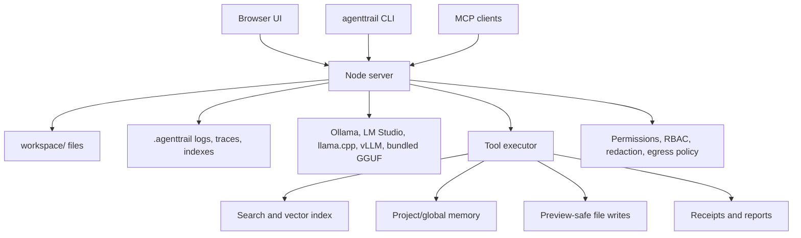

# Architecture Deep Dive

AgentTrail is a local-first agent layer around model runtimes. It does not try to replace Ollama; it adds auditable tools, receipts, memory, safe writes, search, security, and reports.

## System Map

## Core Modules

| Area | Files |
| --- | --- |
| Server and routes | `server.js`, `src/route-catalog.js` |
| Tool permissions | `src/permissions.js`, `src/tool-schemas.js` |
| Search and vectors | `src/features/search.js`, `src/vector-store.js` |
| Safe paths and diffs | `src/workspace-safety.js` |
| Memory and sessions | `server.js`, `src/schemas.js` |
| Security/privacy | `src/features/security.js`, `src/privacy.js`, `src/network-policy.js` |
| Observability | `src/observability.js`, `src/logger.js` |
| Team/RBAC | `src/team-enterprise.js`, `team/users.json` |
| Runtime adapters | `src/model-adapters.js`, `src/bundled-runtime.js` |
| Release proof | `src/release.js`, `scripts/generate-sbom.js`, `scripts/verify-checksums.js` |

## Request Lifecycle

1. User selects files, permissions, model, and optional recipe.
2. Server builds bounded context from selected files, memory, and search results.
3. Model produces text and optional tool calls.
4. Tool arguments are schema-validated and permission-checked.
5. Write-like tools produce diff previews unless explicitly allowed.
6. Observability records trace, timing, tool counts, and classified errors.
7. Receipts/reports preserve what happened for replay and review.

## Local Data Boundaries

| Data | Location |
| --- | --- |
| Workspace files | `workspace/` |
| Receipts | `workspace/receipts/` |
| Reports | `workspace/reports/` |
| Memory | `workspace/memory/` and optional `.local-agent/` |
| Search indexes | `workspace/.agenttrail/` |
| Logs/traces | `workspace/.agenttrail/store.jsonl`, `workspace/.agenttrail/logs.jsonl` |
| Team users | `team/users.json` |

The path resolver blocks reads/writes outside the workspace, and the network policy blocks non-allowlisted egress for configured network flows.

## Why The Foundation Is Small

AgentTrail intentionally avoids a heavy dependency stack. Most features are plain Node modules and deterministic tests. This keeps the project auditable: contributors can inspect the agent loop, permissions, search, memory, and receipts without reverse-engineering a framework.

## Extension Points

- New tools: add schema in `src/tool-schemas.js`, permission policy in `src/permissions.js`, route/test/docs coverage.
- New recipes: add JSON in `recipes/`, then update packs.
- New model backend: implement adapter behavior in `src/model-adapters.js`.
- New docs route: update `scripts/generate-docs-site.js`.
- New API route: update `src/route-catalog.js`, regenerate [API_REFERENCE.md](API_REFERENCE.md), add tests.
