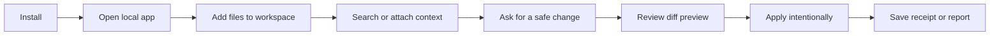

# Getting Started

This is the fastest path to a useful AgentTrail run: install, open, search, preview a safe edit, save a receipt, and export proof.

## 60-Second Flow



## Quick Start

```bash
npx agenttrail
```

This creates `./agenttrail-workspace`, writes `notes/first-run.md`, starts the local app, and keeps write previews gated by Apply.

Check setup:

```bash
npx agenttrail doctor
```

Or from a clone:

```bash
npm run dev
```

Open:

```text
http://127.0.0.1:4173
```

## First Safe Task

The Setup panel now gives you a guided first run:

1. Confirm the workspace folder.
2. Choose the local model AgentTrail should use.
3. Click `Run safe sample` to create and fix `first-run/sample-typo.md` locally.
4. Open Privacy to see the local-only first-run telemetry.
5. Click `Use own project`; AgentTrail drops a safe starter prompt into chat.

For your own file, ask: `Search the workspace, improve notes/demo.md, and show me the diff before applying.`

## What Good Looks Like

| Signal | Expected result |
| --- | --- |
| Search | The trail shows a search/read step before edits. |
| Diff preview | The proposed write appears in Diff Review. |
| Apply | The file changes only after explicit approval. |
| Receipt | The receipt lists model, selected files, tools, diffs, and trust score. |
| Privacy | The app runs on `127.0.0.1` and keeps workspace data local. |

## Demo Assets

- GIF proof: [agenttrail-demo.gif](agenttrail-demo.gif)
- App screenshot: [preview-app.png](preview-app.png)
- Diff screenshot: [preview-diff.png](preview-diff.png)
- Static browser demo: [public-demo.html](public-demo.html)

## Next Guides

- Recipes: [RECIPE_AUTHORING.md](RECIPE_AUTHORING.md)
- Install: [INSTALL.md](INSTALL.md)
- Backends: [BACKEND_SETUP.md](BACKEND_SETUP.md)
- Architecture: [ARCHITECTURE.md](ARCHITECTURE.md)
- Troubleshooting: [TROUBLESHOOTING.md](TROUBLESHOOTING.md)
