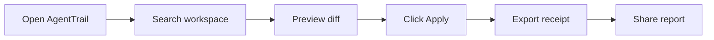

# Launch Response Workflow

Epic AB launch work is designed to make AgentTrail easy to share without turning the maintainer into a full-time support queue. Use this workflow when posting a release, replying to early users, or turning feedback into issues.

## Launch Goal

Show one concrete loop in under a minute:



The public promise should stay narrow: local workspace search, diff-safe writes, visible receipts, replayable sessions, and no hidden cloud dependency.

## Post Copy

Short launch post:

> I built AgentTrail, a local AI agent that shows its work. It searches your workspace, previews diffs before writing, requires Apply, and leaves receipts you can inspect or export. Ollama-first, local-first, and built to be readable instead of magical.

Long launch post:

> AgentTrail is a local AI agent for people who want receipts, not mystery. The demo shows search -> diff preview -> Apply -> receipt/report. It runs with Ollama or an OpenAI-compatible local backend, keeps project memory visible, and stores sessions in your workspace. The goal is a small, inspectable agent layer that developers can learn from, extend, and trust.

## Response Triage

| Signal | Reply | Follow-up |
| --- | --- | --- |
| "Does it work with LM Studio?" | Link to backend setup and ask which model they use. | Add a backend fixture if the model exposes an OpenAI-compatible API. |
| "Can it edit files?" | Explain preview-first writes and explicit Apply. | Link to the diff-safe demo and security checklist. |
| "Is it private?" | Explain local storage, Ollama/local backends, and optional network policy. | Ask for the exact privacy expectation. |
| "How is this different from Open WebUI?" | Be honest: AgentTrail is smaller and focused on auditable local agent runs. | Link to comparison benchmarks. |
| "I want a recipe for X." | Ask for role, input files, expected output, and safety constraints. | Convert into a recipe-pack issue. |
| Bug report | Thank them, ask for OS, Node version, backend, command, and receipt if safe. | Convert into a bug issue with reproduction steps. |

## Response Macros

Privacy:

```text
AgentTrail is local-first: workspace files, receipts, memory, and sessions stay in the project folder by default. If you use Ollama or a local OpenAI-compatible server, prompts stay on your machine. The app also has network policy checks for URL ingestion and tool use.
```

Safety:

```text
The core safety idea is preview before write. The agent can propose a diff, but the user must approve Apply before the file changes. Runs leave receipts so you can inspect what was searched, read, written, and exported.
```

Contribution:

```text
The easiest first contribution is a small recipe, benchmark fixture, docs fix, or showcase entry. The good-first backlog has scoped tasks with acceptance criteria so you do not need to understand the whole codebase.
```

## Launch Checklist

- Verify `docs/agenttrail-demo.gif`, `docs/preview-app.png`, and `docs/preview-diff.png` render in the README.
- Run `npm run test:community` and `npm run eval`.
- Open 5-8 good-first issues from `docs/community/good-first-issues.json`.
- Add labels from `.github/labels.yml`.
- Pin one issue asking for recipe pack submissions.
- Share the short post with the GIF.
- Reply for the first 48 hours using the triage table.
- Move repeated questions into `docs/TROUBLESHOOTING.md`.

## Success Metrics

- 10 useful comments or issues from real users.
- 5 recipe requests with enough detail to implement.
- 3 showcase-worthy workflows.
- 1 comparison benchmark improvement.
- No unresolved safety or privacy confusion in the first wave.
